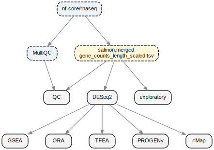

# Bulk RNA-seq Analysis Report Workflow

[](https://github.com/artblakey19/rnaseq-report-MMB/actions/workflows/test.yml)
[](https://github.com/artblakey19/rnaseq-report-MMB/actions/workflows/docker.yml)
[](LICENSE)

[](https://docs.conda.io)
[](https://www.docker.com)
[](https://jupyter.org)

<sub>**EN** · [한국어](README.ko.md)</sub>

Snakemake pipeline that takes salmon gene-count output from **nf-core/rnaseq** and produces HTML reports combining **MultiQC**, **DESeq2**, **GSEA (MSigDB)**, **ORA (clusterProfiler)**, **TFEA (CollecTRI)**, **PROGENy pathway scoring**, and **L2S2 (LINCS L1000) cMap** results.

## Workflow



<sub>Regenerate: `bash docs/generate_rulegraph.sh` (requires graphviz).</sub>
---

## Quick start

Place the counts TSV and `multiqc_data/` in the project directory first.

```bash
# 1. Install Snakemake (Python venv)
python3 -m venv .venv
.venv/bin/pip install snakemake pandas

# 2. Generate config (enter sample information at the prompts)
.venv/bin/python workflow/scripts/init_project.py

# 3. Dry-run (optional — verifies DAG before running)
.venv/bin/snakemake \
  --snakefile workflow/Snakefile \
  --configfile config/config.yaml \
  --use-conda -n

# 4. Run
.venv/bin/snakemake \
  --snakefile workflow/Snakefile \
  --configfile config/config.yaml \
  --use-conda --cores all
```

HTML report is written to `results/report/report.html`.

---

## Docker

Self-contained image bundling Snakemake + conda/mamba. Per-rule R/Python envs
are built on first run and cached under `.snakemake/conda/` on the mounted
project directory.

**Place the counts TSV and `multiqc_data/` in the project directory, then use
the `init` sub-command to generate `config/config.yaml`, `samples.tsv`,
`contrasts.tsv` and run the pipeline.**

```bash
# Generate config (enter sample information at the prompts)
docker run --rm -it \
    -v "$PWD":/project \
    ghcr.io/artblakey19/bulk-rnaseq:latest init

# Run the pipeline against the generated config
docker run --rm \
    -v "$PWD":/project \
    ghcr.io/artblakey19/bulk-rnaseq:latest \
    --configfile config/config.yaml --cores all
```

---

## Jupyter Notebook

Interactive Jupyter Notebook environment mirroring the HTML report.

```bash
docker run --rm \
    -v "$PWD":/project \
    -p 8888:8888 \
    ghcr.io/artblakey19/bulk-rnaseq-jupyter:latest
```

- Copy the `http://127.0.0.1:8888/lab?token=...` URL printed in the terminal into your browser.
- Open `notebooks/explore.ipynb` to analyse.
- Plot labels, cutoffs, and so on can be adjusted freely without rerunning the full Snakemake pipeline.

---

## Inputs

| File                     | Purpose                                                                                                             |
| ------------------------ | ------------------------------------------------------------------------------------------------------------------- |
| `config/config.yaml`     | Global settings: paths, DE / enrichment cutoffs, TF / pathway tools, cMap service.                                  |
| `config/samples.tsv`     | Columns: `sample, condition, replicate, batch`.                                                                     |
| `config/contrasts.tsv`   | Columns: `contrast_id, factor, numerator, denominator, description`.                                                |
| `<counts>.tsv`           | nf-core/rnaseq `salmon.merged.gene_counts_length_scaled.tsv` (col 1 = `gene_id` Ensembl, col 2 = `gene_name` HGNC). |
| `multiqc_data/`          | nf-core/rnaseq MultiQC output directory.                                                                            |

---

## Report sections

| Stage                          | Method                                                          | Primary deliverable                                                    |
| ------------------------------ | --------------------------------------------------------------- | ---------------------------------------------------------------------- |
| **QC**                         | MultiQC aggregation of FastQC / STAR / Salmon / RSeQC metrics.  | Per-sample QC table, library-size and mapping-rate plots.              |
| **Exploratory**                | VST; PCA on top-500 variable genes; sample correlation.         | PCA, scree, dendrogram, correlation heatmap.                           |
| **Differential expression**    | DESeq2 Wald test + apeglm LFC shrinkage.                        | DEG summary, volcano, MA, top-30 DEG heatmap, full results table.      |
| **Gene-set enrichment (GSEA)** | Pre-ranked GSEA (ranking metric: Wald stat).                    | MSigDB H / C2:CP (Reactome, WikiPathways, PID, BioCarta) / C2:CGP / C6 |
| **Over-representation (ORA)**  | `clusterProfiler::enricher()` + KEGG live REST.                 | Per-DB (GO BP, KEGG, Reactome, Hallmark) top-10 up / down              |
| **TFEA**                | decoupler + ULM + CollecTRI                                     | Top-30 TFs + full score table                                          |
| **Pathway activity**           | decoupler + PROGENy                                             | Per-sample z-scored heatmap + treated−control delta (Wilcoxon).        |
| **cMAP**         | L2S2 paired query on up / down DEG signatures.                  | Ranked perturbagens                                                    |
| **Audit trail**                | Config snapshot, MD5, session info                              | Reproducibility block                                                  |

---

## Repository layout

```
Bulk-RNAseq/
├── config/
│   ├── config.yaml              # global settings
│   ├── samples.tsv              # sample metadata
│   └── contrasts.tsv            # DE comparison definitions
├── workflow/
│   ├── Snakefile                # pipeline entry
│   ├── rules/
│   │   ├── qc.smk
│   │   ├── de.smk
│   │   ├── enrichment.smk
│   │   └── report.smk
│   ├── envs/                    # per-rule conda env yamls
│   └── scripts/                 # R / Python implementations
├── report/
│   ├── template.qmd             # parameterised Quarto report
│   ├── sections/                # per-stage partials
│   └── assets/                  # CSS, JS
├── results/                     # pipeline output
├── README.md
└── README.ko.md
```

---

## Reference

### Quantification, counts, QC

- **Salmon** — Patro R. et al. *Salmon provides fast and bias-aware quantification of transcript expression.* Nat Methods 14, 417–419 (2017). https://doi.org/10.1038/nmeth.4197
- **tximport** — Soneson C., Love M.I., Robinson M.D. *Differential analyses for RNA-seq: transcript-level estimates improve gene-level inferences.* F1000Research 4:1521 (2015). https://doi.org/10.12688/f1000research.7563.2
- **MultiQC** — Ewels P. et al. *MultiQC: summarize analysis results for multiple tools and samples in a single report.* Bioinformatics 32(19), 3047–3048 (2016). https://doi.org/10.1093/bioinformatics/btw354

### Differential expression

- **DESeq2** — Love M.I., Huber W., Anders S. *Moderated estimation of fold change and dispersion for RNA-seq data with DESeq2.* Genome Biol. 15, 550 (2014). https://doi.org/10.1186/s13059-014-0550-8
- **apeglm** — Zhu A., Ibrahim J.G., Love M.I. *Heavy-tailed prior distributions for sequence count data: removing the noise and preserving large differences.* Bioinformatics 35(12), 2084–2092 (2019). https://doi.org/10.1093/bioinformatics/bty895

### Gene-set analysis

- **GSEA (method)** — Subramanian A. et al. *Gene set enrichment analysis: a knowledge-based approach for interpreting genome-wide expression profiles.* PNAS 102(43), 15545–15550 (2005). https://doi.org/10.1073/pnas.0506580102
- **fgsea** — Korotkevich G. et al. *Fast gene set enrichment analysis.* bioRxiv (2021). https://doi.org/10.1101/060012
- **clusterProfiler 4.0** — Wu T. et al. *clusterProfiler 4.0: a universal enrichment tool for interpreting omics data.* The Innovation 2(3), 100141 (2021). https://doi.org/10.1016/j.xinn.2021.100141
- **MSigDB / Hallmark** — Liberzon A. et al. *The Molecular Signatures Database (MSigDB) Hallmark Gene Set Collection.* Cell Systems 1(6), 417–425 (2015). https://doi.org/10.1016/j.cels.2015.12.004

### Regulatory and pathway activity inference

- **decoupleR / decoupler-py** — Badia-i-Mompel P. et al. *decoupleR: ensemble of computational methods to infer biological activities from omics data.* Bioinformatics Advances 2(1), vbac016 (2022). https://doi.org/10.1093/bioadv/vbac016
- **CollecTRI** — Müller-Dott S. et al. *Expanding the coverage of regulons from high-confidence prior knowledge for accurate estimation of transcription factor activities.* Nucleic Acids Research gkad841 (2023). https://doi.org/10.1093/nar/gkad841
- **PROGENy** — Schubert M. et al. *Perturbation-response genes reveal signaling footprints in cancer gene expression.* Nat Commun 9, 20 (2018). https://doi.org/10.1038/s41467-017-02391-6

### cMap / connectivity

- **L1000 Connectivity Map** — Subramanian A. et al. *A next generation Connectivity Map: L1000 platform and the first 1,000,000 profiles.* Cell 171(6), 1437–1452 (2017). https://doi.org/10.1016/j.cell.2017.10.049
- **L2S2** — L1000 signature search (Ma'ayan Lab). https://l2s2.maayanlab.cloud
